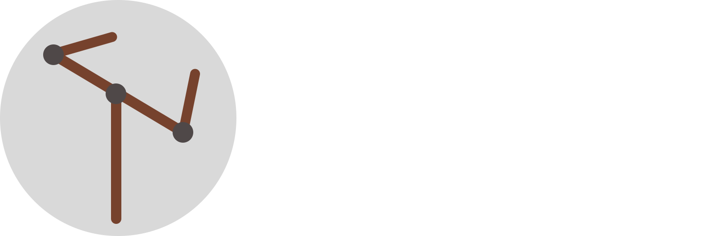

<p align="center">
    <em>The all in one Robotics broker</em>
</p>

---

## What is chappe?

**chappe** is a small message broker, that unifies some of the most common 
robotics IPC patterns under one client

## Installation
Daemon + Cpp 
```sh
curl -sSL https://raw.githubusercontent.com/lolosioann/chappe/main/scripts/install.sh | sh 
```
Python:
```
pip install "git+https://github.com/lolosioann/chappe.git@
```

## Quickstart
Publisher:
```python
import time

from chappe import Node

simple_pub_node = Node("node_name")
try:
    simple_pub_node.connect()
except Exception:
    print("Could not connect to daemon. Make sure chappe is installed and running")
    return

while True:
    simple_pub_node.publish("example_pub_topic", "Hello from Chappe!")
    time.sleep(1)
```

Subscriber:

```python
import time

from chappe import Node


def callback_func(message_payload):
    print(message_payload)


simple_sub_node = Node("node_name")
simple_sub_node.subscribe("example_pub_topic", callback_func)
try:
    simple_sub_node.connect()
except Exception:
    print("Could not connect to daemon. Make sure chappe is installed and running")
    return
    
while True:
    time.sleep(10)
```
